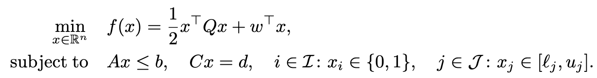

# QiHD

QiHD implements **Quantum-Inspired Hamiltonian Descent** (QIHD), a quantum-inspired, GPU-enabled solver framework for mixed-integer quadratic programming (MIQP).

QIHD generates candidate solutions through Hamiltonian-descent dynamics and can optionally refine them with a classical local optimizer. The current solver pipeline is:

```text
MIQP / QUBO / BoxQP / LCQP problem -> QIHD backend -> optional refiner -> Response
```

## Migration from OpenPhiSolve

QiHD is the successor to OpenPhiSolve, originally developed by Artephi Computing. This repository keeps the original BSD 3-Clause license attribution while continuing development under PhysOpt.

The Python package namespace has changed from `phisolve` to `qihd`. The primary solver class is now `MIQPSolver`; the old `PhiMIQP` name remains available as a compatibility alias.

See [MIGRATION.md](MIGRATION.md) for details.

## Problem formulation

MIQP is a classic optimization model characterized by a quadratic objective function defined over a feasible region with both continuous and binary variables:

<p align="center">

</p>

## Installation

```bash
pip install qihd
```

For CUDA 12 JAX support:

```bash
pip install "qihd[cuda12]"
```

For local development:

```bash
git clone https://github.com/PhysOpt/QiHD.git
cd QiHD
pip install -e .
```

## Quickstart

```python
import numpy as np

from qihd import MIQP, MIQPSolver, QIHD, PDQP

Q = np.array([[2.0, -1.0], [-1.0, 2.0]])
w = np.array([-1.0, -1.0])

problem = MIQP(Q=Q, w=w, n_binary_vars=2)
backend = QIHD(n_shots=100, n_steps=1000, seed=0)
refiner = PDQP()

solver = MIQPSolver(problem, backend=backend, refiner=refiner)
result = solver.solve()

print(result.minimum())
print(result.minimizer)
```

## API overview

- `qihd.problems` contains `MIQP`, `QUBO`, `BoxQP`, and `LCQP` problem classes.
- `QIHD` is the quantum-inspired Hamiltonian descent backend.
- `qihd.refiners` contains classical refiners such as `PDQP`; additional refiners live in the same subpackage.
- `MIQPSolver` orchestrates problem compilation, sample generation, refinement, and response construction.
- `Response` stores samples, objective values, timing details, and solution helpers.

## Compatibility

Existing code using `PhiMIQP` can continue to work during the migration window:

```python
from qihd import PhiMIQP
```

The recommended new import is:

```python
from qihd import MIQPSolver
```

## Provenance

QiHD is derived from OpenPhiSolve. See [NOTICE](NOTICE) and [LICENSE](LICENSE) for attribution and license details.

## Citation

If you use QiHD or Quantum-Inspired Hamiltonian Descent in your work, please cite:

```bibtex
@misc{chaudhary2025quantum,
  title = {Quantum-Inspired Hamiltonian Descent for Mixed-Integer Quadratic Programming},
  author = {Chaudhary, Shreya and Cheng, Jinglei and Kushnir, Samuel and Leng, Jiaqi and Liu, Pengyu and Peng, Yuxiang and Wang, Hanrui and Wu, Xiaodi},
  year = {2025},
  howpublished = {Poster presented at the NeurIPS Workshop on GPU-Accelerated and Scalable Optimization},
  note = {Workshop poster}
}
```

## Contact

For questions, issues, and contributions, please use the GitHub issue tracker.
